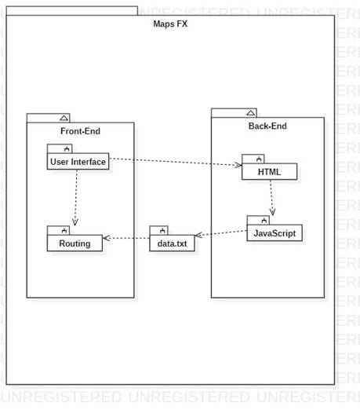

# Maps FX
## About The Project
Maps FX is an app for wheel chair users to use in order to navigate around UCO's campus safely. We used Google's Directions api to perform the navigations.

## Built With
Java FX
Java
HTML
PHP
JQuery
AJAX
Google Maps API
SimpleJSON
JCraft

<html xmlns:v="urn:schemas-microsoft-com:vml"
xmlns:o="urn:schemas-microsoft-com:office:office"
xmlns:w="urn:schemas-microsoft-com:office:word"
xmlns:m="http://schemas.microsoft.com/office/2004/12/omml"
xmlns="http://www.w3.org/TR/REC-html40">
<head>
<meta http-equiv=Content-Type content="text/html; charset=windows-1252">
<meta name=ProgId content=Word.Document>
<meta name=Generator content="Microsoft Word 15">
<meta name=Originator content="Microsoft Word 15">
<link rel=File-List href="combined_files/filelist.xml">
<link rel=Edit-Time-Data href="combined_files/editdata.mso">
</head>

<body lang=EN-US link=blue vlink="#954F72" style='tab-interval:.5in;word-wrap:
break-word'>

<!--[if supportFields]><b
style='mso-bidi-font-weight:normal'> SUBJECT 
\* MERGEFORMAT </b><![endif]--><b
style='mso-bidi-font-weight:normal'>Software Design Specification</b><!--[if supportFields]><b
style='mso-bidi-font-weight:normal'></b><![endif]--><b
style='mso-bidi-font-weight:normal'><o:p></o:p></b>

Wheelchair
Navigation Version 1.0 approved<o:p></o:p>

Prepared
by <o:p></o:p>

<o:p>&nbsp;</o:p>

Reuben
Randell<o:p></o:p>

<o:p>&nbsp;</o:p>

Blake
Brooks<o:p></o:p>

<o:p>&nbsp;</o:p>

Chad
Marshall<o:p></o:p>

<o:p>&nbsp;</o:p>

University
of Central Oklahoma<o:p></o:p>

<o:p>&nbsp;</o:p>

Software
Engineering 1<o:p></o:p>

<o:p>&nbsp;</o:p>

Dr.
Fu<o:p></o:p>

<o:p>&nbsp;</o:p>

March
20th, 2021<b style='mso-bidi-font-weight:normal'><o:p></o:p></b>

<o:p>&nbsp;</o:p>

<o:p>&nbsp;</o:p>

<o:p>&nbsp;</o:p>

<b style='mso-bidi-font-weight:normal'> 
</b>

Revisions<o:p></o:p>

<table class=MsoNormalTable border=1 cellspacing=0 cellpadding=0
 style='margin-left:5.4pt;border-collapse:collapse;border:none;mso-border-alt:
 solid windowtext 1.5pt;mso-padding-alt:0in 5.4pt 0in 5.4pt;mso-border-insideh:
 .75pt solid windowtext;mso-border-insidev:.75pt solid windowtext'>
 <thead>
  <tr style='mso-yfti-irow:0;mso-yfti-firstrow:yes;page-break-inside:avoid'>
   <td width=78 valign=top style='width:58.5pt;border-top:1.5pt;border-left:
   1.5pt;border-bottom:1.0pt;border-right:1.0pt;border-color:windowtext;
   border-style:solid;mso-border-top-alt:1.5pt;mso-border-left-alt:1.5pt;
   mso-border-bottom-alt:.75pt;mso-border-right-alt:.75pt;mso-border-color-alt:
   windowtext;mso-border-style-alt:solid;background:#E5E5E5;mso-shading:windowtext;
   mso-pattern:gray-10 auto;padding:0in 5.4pt 0in 5.4pt'>
   
Version<o:p></o:p>

   </td>
   <td width=102 valign=top style='width:76.5pt;border-top:solid windowtext 1.5pt;
   border-left:none;border-bottom:solid windowtext 1.0pt;border-right:solid windowtext 1.0pt;
   mso-border-left-alt:solid windowtext .75pt;mso-border-alt:solid windowtext .75pt;
   mso-border-top-alt:solid windowtext 1.5pt;background:#E5E5E5;mso-shading:
   windowtext;mso-pattern:gray-10 auto;padding:0in 5.4pt 0in 5.4pt'>
   
Primary Author(s)<o:p></o:p>

   </td>
   <td width=288 valign=top style='width:3.0in;border-top:solid windowtext 1.5pt;
   border-left:none;border-bottom:solid windowtext 1.0pt;border-right:solid windowtext 1.0pt;
   mso-border-left-alt:solid windowtext .75pt;mso-border-alt:solid windowtext .75pt;
   mso-border-top-alt:solid windowtext 1.5pt;background:#E5E5E5;mso-shading:
   windowtext;mso-pattern:gray-10 auto;padding:0in 5.4pt 0in 5.4pt'>
   
Description of Version<o:p></o:p>

   </td>
   <td width=84 valign=top style='width:63.0pt;border-top:solid windowtext 1.5pt;
   border-left:none;border-bottom:solid windowtext 1.0pt;border-right:solid windowtext 1.5pt;
   mso-border-left-alt:solid windowtext .75pt;mso-border-top-alt:1.5pt;
   mso-border-left-alt:.75pt;mso-border-bottom-alt:.75pt;mso-border-right-alt:
   1.5pt;mso-border-color-alt:windowtext;mso-border-style-alt:solid;background:
   #E5E5E5;mso-shading:windowtext;mso-pattern:gray-10 auto;padding:0in 5.4pt 0in 5.4pt'>
   
Date
   Completed<o:p></o:p>

   </td>
  </tr>
 </thead>
 <tr style='mso-yfti-irow:1;page-break-inside:avoid'>
  <td width=78 valign=top style='width:58.5pt;border-top:none;border-left:solid windowtext 1.5pt;
  border-bottom:solid windowtext 1.0pt;border-right:solid windowtext 1.0pt;
  mso-border-top-alt:solid windowtext .75pt;mso-border-alt:solid windowtext .75pt;
  mso-border-left-alt:solid windowtext 1.5pt;padding:0in 5.4pt 0in 5.4pt'>
  
1.0<o:p></o:p>

  </td>
  <td width=102 valign=top style='width:76.5pt;border-top:none;border-left:
  none;border-bottom:solid windowtext 1.0pt;border-right:solid windowtext 1.0pt;
  mso-border-top-alt:solid windowtext .75pt;mso-border-left-alt:solid windowtext .75pt;
  mso-border-alt:solid windowtext .75pt;padding:0in 5.4pt 0in 5.4pt'>
  
Reuben
  Randell<o:p></o:p>

  </td>
  <td width=288 valign=top style='width:3.0in;border-top:none;border-left:none;
  border-bottom:solid windowtext 1.0pt;border-right:solid windowtext 1.0pt;
  mso-border-top-alt:solid windowtext .75pt;mso-border-left-alt:solid windowtext .75pt;
  mso-border-alt:solid windowtext .75pt;padding:0in 5.4pt 0in 5.4pt'>
  
Added JSON, HTML, and API to section 1.3. Updated 2.2 to add
  another design goal, updated sections 3.1 to provide an overview of the
  client-server architecture. Updated 3.2.1 to specify the type of architecture
  used. Added sections 6.1 and 6.2<o:p></o:p>

  </td>
  <td width=84 valign=top style='width:63.0pt;border-top:none;border-left:none;
  border-bottom:solid windowtext 1.0pt;border-right:solid windowtext 1.5pt;
  mso-border-top-alt:solid windowtext .75pt;mso-border-left-alt:solid windowtext .75pt;
  mso-border-alt:solid windowtext .75pt;mso-border-right-alt:solid windowtext 1.5pt;
  padding:0in 5.4pt 0in 5.4pt'>
  
4/21<o:p></o:p>

  </td>
 </tr>
 <tr style='mso-yfti-irow:2;mso-yfti-lastrow:yes;page-break-inside:avoid'>
  <td width=78 valign=top style='width:58.5pt;border-top:none;border-left:solid windowtext 1.5pt;
  border-bottom:solid windowtext 1.5pt;border-right:solid windowtext 1.0pt;
  mso-border-top-alt:solid windowtext .75pt;mso-border-top-alt:.75pt;
  mso-border-left-alt:1.5pt;mso-border-bottom-alt:1.5pt;mso-border-right-alt:
  .75pt;mso-border-color-alt:windowtext;mso-border-style-alt:solid;padding:
  0in 5.4pt 0in 5.4pt'>
  
1.0<o:p></o:p>

  </td>
  <td width=102 valign=top style='width:76.5pt;border-top:none;border-left:
  none;border-bottom:solid windowtext 1.5pt;border-right:solid windowtext 1.0pt;
  mso-border-top-alt:solid windowtext .75pt;mso-border-left-alt:solid windowtext .75pt;
  mso-border-alt:solid windowtext .75pt;mso-border-bottom-alt:solid windowtext 1.5pt;
  padding:0in 5.4pt 0in 5.4pt'>
  
Chad Marshall<o:p></o:p>

  </td>
  <td width=288 valign=top style='width:3.0in;border-top:none;border-left:none;
  border-bottom:solid windowtext 1.5pt;border-right:solid windowtext 1.0pt;
  mso-border-top-alt:solid windowtext .75pt;mso-border-left-alt:solid windowtext .75pt;
  mso-border-alt:solid windowtext .75pt;mso-border-bottom-alt:solid windowtext 1.5pt;
  padding:0in 5.4pt 0in 5.4pt'>
  
&nbsp;Added section 4 and created sequence diagrams<o:p></o:p>

  </td>
  <td width=84 valign=top style='width:63.0pt;border-top:none;border-left:none;
  border-bottom:solid windowtext 1.5pt;border-right:solid windowtext 1.5pt;
  mso-border-top-alt:solid windowtext .75pt;mso-border-left-alt:solid windowtext .75pt;
  padding:0in 5.4pt 0in 5.4pt'>
  
4/21<o:p></o:p>

  </td>
 </tr>
</table>

<a
name="_Hlk107864645">                                               Contents<o:p></o:p></a>

<!--[if supportFields]> TOC \o
&quot;2-4&quot; \h \z \t &quot;Heading 1,1&quot; <![endif]--><a
href="#_Toc528776591">1 Introduction.. <!--[if supportFields]> PAGEREF _Toc528776591 \h <![endif]-->1<!--[if gte mso 9]><xml>
 <w:data>08D0C9EA79F9BACE118C8200AA004BA90B02000000080000000E0000005F0054006F0063003500320038003700370036003500390031000000</w:data>
</xml><![endif]--><!--[if supportFields]><![endif]--></a><o:p></o:p>

<a href="#_Toc528776592">1.1 System Overview... <!--[if supportFields]> PAGEREF _Toc528776592 \h <![endif]-->1<!--[if gte mso 9]><xml>
 <w:data>08D0C9EA79F9BACE118C8200AA004BA90B02000000080000000E0000005F0054006F0063003500320038003700370036003500390032000000</w:data>
</xml><![endif]--><!--[if supportFields]><![endif]--></a><o:p></o:p>

<a href="#_Toc528776593">1.2 Supporting Materials.. <!--[if supportFields]> PAGEREF _Toc528776593 \h <![endif]-->1<!--[if gte mso 9]><xml>
 <w:data>08D0C9EA79F9BACE118C8200AA004BA90B02000000080000000E0000005F0054006F0063003500320038003700370036003500390033000000</w:data>
</xml><![endif]--><!--[if supportFields]><![endif]--></a><o:p></o:p>

<a href="#_Toc528776594">1.3 Definitions and Acronyms.. <!--[if supportFields]> PAGEREF _Toc528776594 \h <![endif]-->1<!--[if gte mso 9]><xml>
 <w:data>08D0C9EA79F9BACE118C8200AA004BA90B02000000080000000E0000005F0054006F0063003500320038003700370036003500390034000000</w:data>
</xml><![endif]--><!--[if supportFields]><![endif]--></a><o:p></o:p>

<a href="#_Toc528776595">2 Design Considerations.. <!--[if supportFields]> PAGEREF _Toc528776595 \h <![endif]-->2<!--[if gte mso 9]><xml>
 <w:data>08D0C9EA79F9BACE118C8200AA004BA90B02000000080000000E0000005F0054006F0063003500320038003700370036003500390035000000</w:data>
</xml><![endif]--><!--[if supportFields]><![endif]--></a><o:p></o:p>

<a href="#_Toc528776596">2.1 Assumptions.. <!--[if supportFields]> PAGEREF _Toc528776596 \h <![endif]--><b>Error! Bookmark not defined.</b><!--[if supportFields]><![endif]--></a><o:p></o:p>

<a href="#_Toc528776597">2.2 Constraints.. <!--[if supportFields]> PAGEREF _Toc528776597 \h <![endif]-->2<!--[if gte mso 9]><xml>
 <w:data>08D0C9EA79F9BACE118C8200AA004BA90B02000000080000000E0000005F0054006F0063003500320038003700370036003500390037000000</w:data>
</xml><![endif]--><!--[if supportFields]><![endif]--></a><o:p></o:p>

<a href="#_Toc528776598">2.3
Goals and Guidelines.. <!--[if supportFields]> PAGEREF _Toc528776598 \h <![endif]-->2<!--[if gte mso 9]><xml>
 <w:data>08D0C9EA79F9BACE118C8200AA004BA90B02000000080000000E0000005F0054006F0063003500320038003700370036003500390038000000</w:data>
</xml><![endif]--><!--[if supportFields]><![endif]--></a><o:p></o:p>

<a href="#_Toc528776599">3 Architecture.. <!--[if supportFields]> PAGEREF _Toc528776599 \h <![endif]-->3<!--[if gte mso 9]><xml>
 <w:data>08D0C9EA79F9BACE118C8200AA004BA90B02000000080000000E0000005F0054006F0063003500320038003700370036003500390039000000</w:data>
</xml><![endif]--><!--[if supportFields]><![endif]--></a><o:p></o:p>

<a href="#_Toc528776600">3.1 Overview... <!--[if supportFields]> PAGEREF _Toc528776600 \h <![endif]-->3<!--[if gte mso 9]><xml>
 <w:data>08D0C9EA79F9BACE118C8200AA004BA90B02000000080000000E0000005F0054006F0063003500320038003700370036003600300030000000</w:data>
</xml><![endif]--><!--[if supportFields]><![endif]--></a><o:p></o:p>

<a href="#_Toc528776601">3.2 Strategies.. <!--[if supportFields]> PAGEREF _Toc528776601 \h <![endif]-->3<!--[if gte mso 9]><xml>
 <w:data>08D0C9EA79F9BACE118C8200AA004BA90B02000000080000000E0000005F0054006F0063003500320038003700370036003600300031000000</w:data>
</xml><![endif]--><!--[if supportFields]><![endif]--></a><o:p></o:p>

<a href="#_Toc528776602">3.2.1 Technical
Environment <!--[if supportFields]> PAGEREF _Toc528776602 \h <![endif]--><b>Error! Bookmark not defined.</b><!--[if supportFields]><![endif]--></a><o:p></o:p>

<a href="#_Toc528776603">3.2.2 Maintainability. <!--[if supportFields]> PAGEREF _Toc528776603 \h <![endif]--><b>Error! Bookmark not defined.</b><!--[if supportFields]><![endif]--></a><o:p></o:p>

<a href="#_Toc528776604">3.2.3 Performance. <!--[if supportFields]> PAGEREF _Toc528776604 \h <![endif]-->3<!--[if gte mso 9]><xml>
 <w:data>08D0C9EA79F9BACE118C8200AA004BA90B02000000080000000E0000005F0054006F0063003500320038003700370036003600300034000000</w:data>
</xml><![endif]--><!--[if supportFields]><![endif]--></a><o:p></o:p>

<a href="#_Toc528776605">3.3 Software Specification.. <!--[if supportFields]> PAGEREF _Toc528776605 \h <![endif]-->3<!--[if gte mso 9]><xml>
 <w:data>08D0C9EA79F9BACE118C8200AA004BA90B02000000080000000E0000005F0054006F0063003500320038003700370036003600300035000000</w:data>
</xml><![endif]--><!--[if supportFields]><![endif]--></a><o:p></o:p>

<a href="#_Toc528776606">3.4 Hardware Specification.. <!--[if supportFields]> PAGEREF _Toc528776606 \h <![endif]-->3<!--[if gte mso 9]><xml>
 <w:data>08D0C9EA79F9BACE118C8200AA004BA90B02000000080000000E0000005F0054006F0063003500320038003700370036003600300036000000</w:data>
</xml><![endif]--><!--[if supportFields]><![endif]--></a><o:p></o:p>

<a href="#_Toc528776607">4 System Level Design.. <!--[if supportFields]> PAGEREF _Toc528776607 \h <![endif]-->5<!--[if gte mso 9]><xml>
 <w:data>08D0C9EA79F9BACE118C8200AA004BA90B02000000080000000E0000005F0054006F0063003500320038003700370036003600300037000000</w:data>
</xml><![endif]--><!--[if supportFields]><![endif]--></a><o:p></o:p>

<a href="#_Toc528776608">4.1 Hierarchy
Chart Of Components.. <!--[if supportFields]> PAGEREF _Toc528776608 \h <![endif]-->5<!--[if gte mso 9]><xml>
 <w:data>08D0C9EA79F9BACE118C8200AA004BA90B02000000080000000E0000005F0054006F0063003500320038003700370036003600300038000000</w:data>
</xml><![endif]--><!--[if supportFields]><![endif]--></a><o:p></o:p>

<a href="#_Toc528776609">4.2
Sequence Diagrams And Descriptions.. <!--[if supportFields]> PAGEREF _Toc528776609 \h <![endif]-->7<!--[if gte mso 9]><xml>
 <w:data>08D0C9EA79F9BACE118C8200AA004BA90B02000000080000000E0000005F0054006F0063003500320038003700370036003600300039000000</w:data>
</xml><![endif]--><!--[if supportFields]><![endif]--></a><o:p></o:p>

<a href="#_Toc528776610">5 Object Level Design.. <!--[if supportFields]> PAGEREF _Toc528776610 \h <![endif]-->10<!--[if gte mso 9]><xml>
 <w:data>08D0C9EA79F9BACE118C8200AA004BA90B02000000080000000E0000005F0054006F0063003500320038003700370036003600310030000000</w:data>
</xml><![endif]--><!--[if supportFields]><![endif]--></a><o:p></o:p>

<a href="#_Toc528776611">5.1 Component C1. <!--[if supportFields]> PAGEREF _Toc528776611 \h <![endif]--><b>Error! Bookmark not defined.</b><!--[if supportFields]><![endif]--></a><o:p></o:p>

<a href="#_Toc528776612">5.1.1 Class D1 Of Component C1. <!--[if supportFields]> PAGEREF _Toc528776612 \h <![endif]--><b>Error! Bookmark not defined.</b><!--[if supportFields]><![endif]--></a><o:p></o:p>

<a href="#_Toc528776613">5.2 Component C2. <!--[if supportFields]> PAGEREF _Toc528776613 \h <![endif]--><b>Error! Bookmark not defined.</b><!--[if supportFields]><![endif]--></a><o:p></o:p>

<a href="#_Toc528776614">6 User Interface Design.. <!--[if supportFields]> PAGEREF _Toc528776614 \h <![endif]-->11<!--[if gte mso 9]><xml>
 <w:data>08D0C9EA79F9BACE118C8200AA004BA90B02000000080000000E0000005F0054006F0063003500320038003700370036003600310034000000</w:data>
</xml><![endif]--><!--[if supportFields]><![endif]--></a><o:p></o:p>

<a href="#_Toc528776615">6.1 User
Interface Design Overview... <!--[if supportFields]> PAGEREF _Toc528776615 \h <![endif]-->11<!--[if gte mso 9]><xml>
 <w:data>08D0C9EA79F9BACE118C8200AA004BA90B02000000080000000E0000005F0054006F0063003500320038003700370036003600310035000000</w:data>
</xml><![endif]--><!--[if supportFields]><![endif]--></a><o:p></o:p>

<a href="#_Toc528776616">6.2 User
Interface Navigation Hierarchy.. <!--[if supportFields]> PAGEREF _Toc528776616 \h <![endif]-->11<!--[if gte mso 9]><xml>
 <w:data>08D0C9EA79F9BACE118C8200AA004BA90B02000000080000000E0000005F0054006F0063003500320038003700370036003600310036000000</w:data>
</xml><![endif]--><!--[if supportFields]><![endif]--></a><o:p></o:p>

<a href="#_Toc528776617">7
Requirements Traceability Matrix.. <!--[if supportFields]> PAGEREF _Toc528776617 \h <![endif]-->Error!
Bookmark not defined.<!--[if supportFields]><![endif]--></a><o:p></o:p>

<a href="#_Toc528776618">8
Appendices.. <!--[if supportFields]> PAGEREF _Toc528776618 \h <![endif]-->12<!--[if gte mso 9]><xml>
 <w:data>08D0C9EA79F9BACE118C8200AA004BA90B02000000080000000E0000005F0054006F0063003500320038003700370036003600310038000000</w:data>
</xml><![endif]--><!--[if supportFields]><![endif]--></a><o:p></o:p>

<!--[if supportFields]><b style='mso-bidi-font-weight:normal'></b><![endif]--><o:p>&nbsp;</o:p>

 

<h1 style='margin-left:0in;text-indent:0in;mso-list:l3 level1 lfo1;background:
#4C4C4C;mso-shading:windowtext;mso-pattern:gray-70 auto'><a
name="_Toc528776591"><![if !supportLists]>1 <![endif]>Introduction</a><o:p></o:p></h1>

<h2 style='margin-left:0in;text-indent:0in;mso-list:l3 level2 lfo1'><a name="_Toc528776592"><![if !supportLists]>1.1 <![endif]>System Overview</a><o:p></o:p></h2>

Maps FX’s goal is to provide an
application to not only those who have disabilities, but any user so that they
can navigate to and from buildings on campus. Given that the user has an
internet connection and a laptop, the user can travel anywhere on campus. The
front-end design is created with JavaFX which allows the user to use the app on
the plethora of devices that uses Java Runtime Environment. The back-end design
is written in HTML with JavaScript. The responses from the API calls are
received in JSON format and parsed at the JavaScript level.&nbsp;<o:p></o:p>

<o:p>&nbsp;</o:p>

<h2 style='margin-left:0in;text-indent:0in;mso-list:l3 level2 lfo1'><a
name="_Toc528776593"><![if !supportLists]>1.2 <![endif]>Supporting Materials</a><o:p></o:p></h2>

For
a uniform coding style, we are using Google’s Style so that there is uniformity
from Google’s HTML skeleton code to Java. Please refer to the documentation
below:<o:p></o:p>

<a
href="https://checkstyle.sourceforge.io/google_style.html">https://checkstyle.sourceforge.io/google_style.html</a><o:p></o:p>

Instead
of using Java’s standard GUI elements, we need something more powerful that
could handle the integration of web pages. Java FX was the solution to this
requirement. Please refer to the documentation below:<o:p></o:p>

<a
href="https://openjfx.io/javadoc/16/">https://openjfx.io/javadoc/16/</a><o:p></o:p>

<o:p>&nbsp;</o:p>

<h2 style='margin-left:0in;text-indent:0in;mso-list:l3 level2 lfo1'><a name="_Toc528776594"><![if !supportLists]>1.3 <![endif]>Definitions and Acronyms</a><o:p></o:p></h2>

&lt;Define any important terms, acronyms, or abbreviations.&gt;<o:p></o:p>

<table class=MsoNormalTable border=1 cellspacing=0 cellpadding=0 width="95%"
 style='width:95.16%;margin-left:19.4pt;border-collapse:collapse;border:none;
 mso-border-alt:solid windowtext .5pt;mso-yfti-tbllook:480;mso-padding-alt:
 0in 5.4pt 0in 5.4pt;mso-border-insideh:.5pt solid windowtext;mso-border-insidev:
 .5pt solid windowtext'>
 <tr style='mso-yfti-irow:0;mso-yfti-firstrow:yes'>
  <td width="28%" valign=top style='width:28.1%;border:solid windowtext 1.0pt;
  mso-border-alt:solid windowtext .5pt;background:#E6E6E6;padding:0in 5.4pt 0in 5.4pt'>
  
<b>Term</b><b><o:p></o:p></b>

  </td>
  <td width="71%" valign=top style='width:71.9%;border:solid windowtext 1.0pt;
  border-left:none;mso-border-left-alt:solid windowtext .5pt;mso-border-alt:
  solid windowtext .5pt;background:#E6E6E6;padding:0in 5.4pt 0in 5.4pt'>
  
<b>Description</b><b><o:p></o:p></b>

  </td>
 </tr>
 <tr style='mso-yfti-irow:1'>
  <td width="28%" valign=top style='width:28.1%;border:solid windowtext 1.0pt;
  border-top:none;mso-border-top-alt:solid windowtext .5pt;mso-border-alt:solid windowtext .5pt;
  padding:0in 5.4pt 0in 5.4pt'>
  
<b>JSON<o:p></o:p></b>

  </td>
  <td width="71%" valign=top style='width:71.9%;border-top:none;border-left:
  none;border-bottom:solid windowtext 1.0pt;border-right:solid windowtext 1.0pt;
  mso-border-top-alt:solid windowtext .5pt;mso-border-left-alt:solid windowtext .5pt;
  mso-border-alt:solid windowtext .5pt;padding:0in 5.4pt 0in 5.4pt'>
  
  Javascript Object Notation<o:p></o:p>

  </td>
 </tr>
 <tr style='mso-yfti-irow:2'>
  <td width="28%" valign=top style='width:28.1%;border:solid windowtext 1.0pt;
  border-top:none;mso-border-top-alt:solid windowtext .5pt;mso-border-alt:solid windowtext .5pt;
  padding:0in 5.4pt 0in 5.4pt'>
  
<b>HTML<o:p></o:p></b>

  </td>
  <td width="71%" valign=top style='width:71.9%;border-top:none;border-left:
  none;border-bottom:solid windowtext 1.0pt;border-right:solid windowtext 1.0pt;
  mso-border-top-alt:solid windowtext .5pt;mso-border-left-alt:solid windowtext .5pt;
  mso-border-alt:solid windowtext .5pt;padding:0in 5.4pt 0in 5.4pt'>
  
Hypertext markup language<o:p></o:p>

  </td>
 </tr>
 <tr style='mso-yfti-irow:3;mso-yfti-lastrow:yes'>
  <td width="28%" valign=top style='width:28.1%;border:solid windowtext 1.0pt;
  border-top:none;mso-border-top-alt:solid windowtext .5pt;mso-border-alt:solid windowtext .5pt;
  padding:0in 5.4pt 0in 5.4pt'>
  
<b>API<o:p></o:p></b>

  </td>
  <td width="71%" valign=top style='width:71.9%;border-top:none;border-left:
  none;border-bottom:solid windowtext 1.0pt;border-right:solid windowtext 1.0pt;
  mso-border-top-alt:solid windowtext .5pt;mso-border-left-alt:solid windowtext .5pt;
  mso-border-alt:solid windowtext .5pt;padding:0in 5.4pt 0in 5.4pt'>
  
Application Programming Interface<o:p></o:p>

  </td>
 </tr>
</table>

<o:p>&nbsp;</o:p>

<h1 style='margin-left:0in;text-indent:0in;mso-list:l3 level1 lfo1;background:
#4C4C4C;mso-shading:windowtext;mso-pattern:gray-70 auto'><a
name="_Toc528776595"><![if !supportLists]>2 <![endif]>Design Considerations</a><o:p></o:p></h1>

<h2 style='margin-left:0in;text-indent:0in;mso-list:l3 level2 lfo1'><a name="_Toc528776597"><![if !supportLists]>2.1 <![endif]>Constraints</a><o:p></o:p></h2>

One of the largest constraints is transferring data between
front-end to back-end systems. In its current design, most of the work is
handled on the front-end and an acceptible parameter
for Google’s Roads API is written to a text file as a JSON object in Java and
read by the HTML file and parsed as a JSON object in JavaScript. After parsing
the object, a path variable is assigned to the object and then passed to the
Roads API call. This is clunky and data reading on back-end isn’t as snappy as
writing it on the front-end. This system will more than likely be overhauled
with the future developments made with the Directions API.
&nbsp;<o:p></o:p>

<h2 style='margin-left:0in;text-indent:0in;mso-list:l3 level2 lfo1'><a name="_Toc528776598"><![if !supportLists]>2.2 <![endif]>Goals and Guidelines</a><o:p></o:p></h2>

Building a Sand Castle grain by grain.<o:p></o:p>

A goal in the
development process is to make use of Object Orientation principles such that
the code written is reusable and simple to expand upon by anyone that works on
this project. Such principles include using classes to form objects like a sand castle; constantly expanding and being changed to
withstand the high-tide of changing requirements. By using classes instead of
stuffing methods and operations just in the main allows simpler solutions to
more complex problems. Solutions mentioned include the use of inheritance to
generalize class structure and define cut and dried dependency
relationships.&nbsp;&nbsp;<o:p></o:p>

Another goal is to make
a simple, but useful, product that is easy to use, simple to navigate, and does
its job without error.<o:p></o:p>

<h1 style='margin-left:0in;text-indent:0in;mso-list:l3 level1 lfo1;background:
#4C4C4C;mso-shading:windowtext;mso-pattern:gray-70 auto'><a name="_Toc528776599"><![if !supportLists]>3 <![endif]>Architecture</a><o:p></o:p></h1>

<h2 style='margin-left:0in;text-indent:0in;mso-list:l3 level2 lfo1'><a name="_Toc528776600"><![if !supportLists]>3.1 <![endif]>Overview</a><o:p></o:p></h2>

The map is displayed on the client
side so that the user can see what the map and route look like. After the user
inputs a start and end location, the coordinates of those locations will be
passed on to the server, to calculate the route from the start point to the end
point. The route is calculated using the ‘breadcrumbs’ (interpolated points
that the API believes will make up our route) received from the server, after
passing two waypoints (start and end locations) to the server. After receiving
the breadcrumbs, the client can then display the route on the map (after some
additional parsing and/or calculations done on the client side). Any directions
will be calculated on the client side using those breadcrumbs received from the
server, since the APIs being used do not include functionality for displaying
directions. After the route is calculated, the directions are then calculated
and displayed on the client side so that the user can see the instructions for
getting to their destination.<o:p></o:p>

<h2 style='margin-left:0in;text-indent:0in;mso-list:l3 level2 lfo1'><a name="_Toc528776601"><![if !supportLists]>3.2 <![endif]>Strategies</a><o:p></o:p></h2>

<h3 style='margin-left:0in;text-indent:0in;mso-list:l3 level3 lfo1'><![if !supportLists]>3.2.1 <![endif]>Architectural Style<o:p></o:p></h3>

Architectural
style is client/server because it uses an API that connects to the internet to
request and receive things like coordinates.<o:p></o:p>

<h3 style='margin-left:0in;text-indent:0in;mso-list:l3 level3 lfo1'><a name="_Toc528776604"><![if !supportLists]>3.2.2 <![endif]>Performance</a><o:p></o:p></h3>

<h2 style='margin-left:0in;text-indent:0in;mso-list:l3 level2 lfo1'><a name="_Toc528776605"><![if !supportLists]>3.3 <![endif]>Software Specification</a><o:p></o:p></h2>

<h2 style='margin-left:0in;text-indent:0in;mso-list:l3 level2 lfo1'><a name="_Toc528776606"><![if !supportLists]>3.4 <![endif]>Hardware Specification</a><o:p></o:p></h2>

·&nbsp; &nbsp; &nbsp; &nbsp; &nbsp;Clients<o:p></o:p>

o &nbsp; Input devices:<o:p></o:p>

<![if !supportLists]>·&nbsp;&nbsp;&nbsp;&nbsp;&nbsp;&nbsp;&nbsp;&nbsp;
<![endif]>Keyboard<o:p></o:p>

<![if !supportLists]>·&nbsp;&nbsp;&nbsp;&nbsp;&nbsp;&nbsp;&nbsp;&nbsp;
<![endif]>Mouse<o:p></o:p>

o Output
devices:<o:p></o:p>

<![if !supportLists]>·&nbsp;&nbsp;&nbsp;&nbsp;&nbsp;&nbsp;&nbsp;&nbsp;
<![endif]>Display/monitor<o:p></o:p>

o &nbsp; PCs and laptops only<o:p></o:p>

· &nbsp; &nbsp; &nbsp; &nbsp; Servers<o:p></o:p>

o &nbsp; Routes API servers<o:p></o:p>

o &nbsp; Accessible by many users<o:p></o:p>

· &nbsp; &nbsp; &nbsp; &nbsp; Network<o:p></o:p>

o &nbsp; Connects clients and servers<o:p></o:p>

<o:p>&nbsp;</o:p>

<h1 style='margin-left:0in;text-indent:0in;mso-list:l3 level1 lfo1;background:
#4C4C4C;mso-shading:windowtext;mso-pattern:gray-70 auto'><a name="_Toc528776607"><![if !supportLists]>4 <![endif]>System Level Design</a><o:p></o:p></h1>

<o:p>&nbsp;</o:p>

The
main idea around the use of Java for the front end is that we need most of the
duties like route creation, logic and arithmetic, and computations to happen on
the Java side of things so that the only amount of data that needs to be sent
to the back-end is a single literal string that can be
parsed and orchestrated by the JavaScript to perform a series of operations in
HTML.<o:p></o:p>

<h2 style='margin-left:0in;text-indent:0in;mso-list:l3 level2 lfo1'><a name="_Toc528776608"><![if !supportLists]>4.1 <![endif]>Hierarchy Chart </a>Of Components    <o:p></o:p></h2>

<o:p>&nbsp;</o:p>

<!--[if gte vml 1]><v:shapetype
 id="_x0000_t75" coordsize="21600,21600" o:spt="75" o:preferrelative="t"
 path="m@4@5l@4@11@9@11@9@5xe" filled="f" stroked="f">
 <v:stroke joinstyle="miter"/>
 <v:formulas>
  <v:f eqn="if lineDrawn pixelLineWidth 0"/>
  <v:f eqn="sum @0 1 0"/>
  <v:f eqn="sum 0 0 @1"/>
  <v:f eqn="prod @2 1 2"/>
  <v:f eqn="prod @3 21600 pixelWidth"/>
  <v:f eqn="prod @3 21600 pixelHeight"/>
  <v:f eqn="sum @0 0 1"/>
  <v:f eqn="prod @6 1 2"/>
  <v:f eqn="prod @7 21600 pixelWidth"/>
  <v:f eqn="sum @8 21600 0"/>
  <v:f eqn="prod @7 21600 pixelHeight"/>
  <v:f eqn="sum @10 21600 0"/>
 </v:formulas>
 <v:path o:extrusionok="f" gradientshapeok="t" o:connecttype="rect"/>
 <o:lock v:ext="edit" aspectratio="t"/>
</v:shapetype><v:shape id="_x0000_i1025" type="#_x0000_t75" style='width:344.25pt;
 height:391.5pt'>
 <v:imagedata src="combined_files/image001.jpg" o:href="https://lh4.googleusercontent.com/BkkgIXDgDZu23rTfnVhCsLGoVHMubQltD3yiLePeROW6zbrk9I_-RS9OrG_QJ8on_vShEtzMCJ0iA5PlisAoHhwuOgEbwNqKdW3BaVOypBVZUsZi-gDD_KHmrsnlcMmZ3jRgzw_v"/>
</v:shape><![endif]--><![if !vml]><![endif]><o:p></o:p>

Possibly the highest level of
components as mentioned above would be between how the Front-End communicates
with the back-end. As one could see, most of the work
is done through our Routing subsystem and the fruits of its labor is
distributed to the User Interface in the form of a GUI and also given to the Back-End through data.txt to power the map navigation on the
HTML side.&nbsp;<o:p></o:p>

The User Interface subsystem is
broken up between the Main class, the entry point of the System as a whole and
a facade class called Display, which acts as a means of printing certain
objects throughout the system.&nbsp;&nbsp;<o:p></o:p>

The Routing System is made up of a
Coordinate class, Waypoint (singular) class, Waypoints (plural) class, and a
Route class. Route, Waypoint, and Waypoints make up a composite pattern.
Connecting the two systems in an interface Path which takes similar functions
throughout the system and hides their complexities by creating a single Display
object and calling whichever print we need. For specifics of each pattern used,
please refer to section 5.<o:p></o:p>

<!--[if gte vml 1]><v:shape id="_x0000_i1026"
 type="#_x0000_t75" style='width:412.5pt;height:430.5pt'>
 <v:imagedata src="combined_files/image003.jpg" o:href="https://lh5.googleusercontent.com/mDBt2nUB5ZexH0pn0wYKnaLz2OPBENIA5g0P1Xxk6jE0Q5n8Jqgn5NvGbyTtt2aPUfwKpNDzXQxGvjjE_CUBK013f88-i6iSEcRa35mDBspSyv4fKPaBC0ef_iXVn6pMhatu4enn"/>
</v:shape><![endif]--><![if !vml]><![endif]><o:p></o:p>

<o:p>&nbsp;</o:p>

<o:p>&nbsp;</o:p>

<o:p>&nbsp;</o:p>

<o:p>&nbsp;</o:p>

<h2 style='margin-left:0in;text-indent:0in;mso-list:l3 level2 lfo1'><a name="_Toc528776609"><![if !supportLists]>4.2 <![endif]>Sequence Diagrams </a>And Descriptions<o:p></o:p></h2>

<o:p>&nbsp;</o:p>

<!--[if gte vml 1]><v:shape id="_x0000_i1027"
 type="#_x0000_t75" style='width:454.5pt;height:236.25pt'>
 <v:imagedata src="combined_files/image005.jpg" o:href="https://lh6.googleusercontent.com/Acpj4vj-HRMrIID3s3IlEA_en9eGWp8Xcdx9KkyInuJDAQoLaT4rAvGsWIJvpFdpvBg3ZAZWk23RJwCXBad0LQ-LQ-CYnuHQcSCiqRhWz0IMSqGl2288qW50vQ-E6HlUO2CRtsHP"/>
</v:shape><![endif]--><![if !vml]><![endif]> <!--[if gte vml 1]><v:shape id="_x0000_i1028"
 type="#_x0000_t75" style='width:509.25pt;height:333.75pt'>
 <v:imagedata src="combined_files/image007.jpg" o:href="https://lh3.googleusercontent.com/Zw-0Y9lYHu-jbpJoF7EszQqABy1xo3rMy5xcWRDPwM93Y9oagqV6AEj6xS11IoWatCjIngSsN-AT8BVwWKrqMgOZNqsdNIhsxkfVh_pPpNQPXadCLwj81QE0CIuDEMpu0OpNXpEo"/>
</v:shape><![endif]--><![if !vml]><![endif]><!--[if gte vml 1]><v:shape
 id="_x0000_i1029" type="#_x0000_t75" style='width:473.25pt;height:223.5pt'>
 <v:imagedata src="combined_files/image009.jpg" o:href="https://lh6.googleusercontent.com/Ta4EgFzaTrEU2N0Dgi0pzP8k8S8pYRAusU8UUIoo_YYRnw9ufoUh0DlEC-VDIin1hf52Dbfigp0UQgu1QpHAu_0T4UEWG1Xd3cMaUSzZ6lqYXuXBiynIpOWwpqdazi9P4tCa0XOs"/>
</v:shape><![endif]--><![if !vml]><![endif]><o:p></o:p>

Although there are no in either
HTML or JavaScript, the events that take place can be mapped sequentially and
are thus&nbsp; helpful when navigating through Routing
and User Interface subsystems.<o:p></o:p>

<o:p>&nbsp;</o:p>

<h1 style='margin-left:0in;text-indent:0in;mso-list:l3 level1 lfo1;background:
#4C4C4C;mso-shading:windowtext;mso-pattern:gray-70 auto'><a name="_Toc528776610"><![if !supportLists]>5 <![endif]>Object Level Design</a><o:p></o:p></h1>

<o:p>&nbsp;</o:p>

<!--[if gte vml 1]><v:shape
 id="_x0000_i1030" type="#_x0000_t75" style='width:443.25pt;height:348pt'>
 <v:imagedata src="combined_files/image011.jpg" o:href="https://lh3.googleusercontent.com/pWH2V0mVwQczvYg5KJgu2-F8NfB7466I6FJr-b145LPQHY52l1_ERWv9zqv0gEYUQJzRUvNuANBnIf0RO6AvrjeK9I0NDskdUxpKoJAieV5R0riLVbEalU-dJkMoETZH0iKIdGCV"/>
</v:shape><![endif]--><![if !vml]><![endif]><o:p></o:p>

<o:p>&nbsp;</o:p>

<h1 style='margin-left:0in;text-indent:0in;mso-list:l3 level1 lfo1;background:
#4C4C4C;mso-shading:windowtext;mso-pattern:gray-70 auto'><a name="_Toc528776614"><![if !supportLists]>6 <![endif]>User Interface Design</a><o:p></o:p></h1>

<h2 style='margin-left:0in;text-indent:0in;mso-list:l3 level2 lfo1'><a
name="_Toc528776615"><![if !supportLists]>6.1 <![endif]>User Interface Design Overview</a><o:p></o:p></h2>

<o:p>&nbsp;</o:p>

The user interface will be composed of primarily two screens. One
screen will simply have a checkbox to determine if the user is a wheelchair
user, alongside a text box for administrator login, and a login button. The
second screen (which the user can get to by pressing the login button on the
first screen) will include a window to display the text boxes for building
lookup, the directions, and the map. The text boxes will allow text entry, with
an autocomplete feature that allows the user to search for a building more
quickly. The autocomplete feature will activate when the user has stopped
typing for more than 0.25 seconds. The text boxes for starting/ending points
will be on the left side of the screen. When a user is finished entering their
starting position and destination, they will have to click the submit button to
send the data to the server for processing. The map will allow the user to view
the campus and the route to their destination. The map will be in the middle of
the screen. The user will be allowed to manipulate the map using their mouse.
On the bottom of the screen will be the directions display, for displaying the
directions to their destination.<o:p></o:p>

<h2 style='margin-left:0in;text-indent:0in;mso-list:l3 level2 lfo1'><a
name="_Toc528776616"><![if !supportLists]>6.2 <![endif]>User Interface Navigation Hierarchy</a><o:p></o:p></h2>

<o:p>&nbsp;</o:p>

<!--[if gte vml 1]><v:shape id="_x0000_i1031" type="#_x0000_t75"
 style='width:370.5pt;height:249.75pt'>
 <v:imagedata src="combined_files/image013.png" o:href="https://lh5.googleusercontent.com/lANJO5jeBRjFwduNqcOvGJofmbfcucYriQcNLtA1PpiRyIopCanTK87MsSlHDImXmcNYE9P1iOAqowkPHEo6Tc8zhNcHI2rS5bdJlHXOKp0vUJHuaBzbexDhWuAe5qRIw5SsrZua"/>
</v:shape><![endif]--><![if !vml]><![endif]><o:p></o:p>

<h1 style='margin-left:0in;text-indent:0in;mso-list:l3 level1 lfo1;background:
#4C4C4C;mso-shading:windowtext;mso-pattern:gray-70 auto'><a name="_Toc528776618"><![if !supportLists]>7 <![endif]>Appendices</a><o:p></o:p></h1>

<o:p>&nbsp;</o:p>

<![if !supportLists]>·&nbsp;&nbsp;&nbsp;&nbsp;&nbsp;&nbsp;&nbsp;&nbsp;
<![endif]>Implement Directions API to solve routing issues.&nbsp;<o:p></o:p>

<![if !supportLists]>·&nbsp;&nbsp;&nbsp;&nbsp;&nbsp;&nbsp;&nbsp;&nbsp;
<![endif]>In section 1.1, should javascript and
HTML be called back-end design or front end, since I believe they are also for
the client-side?<o:p></o:p>

<o:p>&nbsp;</o:p>

 

<o:p>&nbsp;</o:p>

<o:p>&nbsp;</o:p>

<o:p>&nbsp;</o:p>

<b>Software
Requirements Specification<o:p></o:p></b>

<a name="_Hlk107864370">Wheelchair
Navigation Version 1.0 approved<o:p></o:p></a>

<a name="_Hlk107864377">Prepared
by <o:p></o:p></a>

Reuben Randell<o:p></o:p>

Blake Brooks<o:p></o:p>

Chad Marshall<o:p></o:p>

University of Central Oklahoma<o:p></o:p>

Software Engineering 1<o:p></o:p>

Dr. Fu<o:p></o:p>

March 20th, 2021<b style='mso-bidi-font-weight:normal'><o:p></o:p></b>

 
<![if !supportLineBreakNewLine]> 
<![endif]><o:p></o:p>

 

<o:p>&nbsp;</o:p>

                                               Contents<o:p></o:p>

Revision
History...........................................................................................................
ii<o:p></o:p>

<b>1.   Introduction............................................................................................................
1<o:p></o:p></b>

1.1        Purpose
and
Scope............................................................................................
1<o:p></o:p>

1.2        Definitions,
Acronyms and
Abbreviations.......................................................... 1<o:p></o:p>

1.3        References.......................................................................................................
1<o:p></o:p>

1.4        Overview.........................................................................................................
1<o:p></o:p>

<b>2.   Overall
Description................................................................................................
1<o:p></o:p></b>

2.1        Product
Functions.............................................................................................
1<o:p></o:p>

2.2        User
Classes and
Characteristics........................................................................
1<o:p></o:p>

2.3        Constraints.......................................................................................................
2<o:p></o:p>

2.4        Assumptions
and
Dependencies.........................................................................
2<o:p></o:p>

<b>3.   Specific requirements............................................................................................
2<o:p></o:p></b>

3.1        External
Interface
Requirements........................................................................
2<o:p></o:p>

3.1.1    User Interfaces.............................................................................................
2<o:p></o:p>

3.1.2    Hardware
Interfaces......................................................................................
2<o:p></o:p>

3.1.3    Software Interfaces.......................................................................................
2<o:p></o:p>

3.1.4    Communications
Interfaces...........................................................................
3<o:p></o:p>

3.2        Functional
requirements....................................................................................
3<o:p></o:p>

3.2.1    Functional requirement
1...............................................................................
3<o:p></o:p>

3.2.2    Functional requirement
2...............................................................................
3<o:p></o:p>

3.3        Performance
Requirements................................................................................
3<o:p></o:p>

<b>3.4</b><b>        Software
System
Attributes...............................................................................
4<o:p></o:p></b>

3.4.1    Availability..................................................................................................
4<o:p></o:p>

3.4.2    Security........................................................................................................
4<o:p></o:p>

3.5        Design
constraints.............................................................................................
4<o:p></o:p>

3.5.1    Standards
Compliance...................................................................................
4<o:p></o:p>

3.5.2    Hardware Limitations....................................................................................
4<o:p></o:p>

Appendix A: Issues
List...............................................................................................
4<o:p></o:p>

<b style='mso-bidi-font-weight:normal'> <o:p></o:p></b>

<b style='mso-bidi-font-weight:normal'> <o:p></o:p></b>

<o:p>&nbsp;</o:p>

<o:p>&nbsp;</o:p>

<b style='mso-bidi-font-weight:normal'> 
</b>

<b style='mso-bidi-font-weight:normal'><o:p>&nbsp;</o:p></b>

<b style='mso-bidi-font-weight:normal'>Revision History<o:p></o:p></b>

<table class=MsoNormalTable border=1 cellspacing=0 cellpadding=0 width=606
 style='width:454.5pt;border-collapse:collapse;border:none;mso-border-alt:solid black .75pt;
 mso-yfti-tbllook:1536;mso-padding-alt:0in 5.4pt 0in 5.4pt;mso-border-insideh:
 .75pt solid black;mso-border-insidev:.75pt solid black'>
 <tr style='mso-yfti-irow:0;mso-yfti-firstrow:yes;height:31.0pt'>
  <td width=135 valign=top style='width:101.25pt;border-top:1.5pt;border-left:
  1.5pt;border-bottom:4.5pt;border-right:1.0pt;border-color:black;border-style:
  solid;padding:5.0pt 5.0pt 5.0pt 5.0pt;height:31.0pt'>
  
<b style='mso-bidi-font-weight:normal'>Name<o:p></o:p></b>

  </td>
  <td width=88 valign=top style='width:66.0pt;border-top:solid black 1.5pt;
  border-left:none;border-bottom:solid black 4.5pt;border-right:solid black 1.0pt;
  mso-border-left-alt:solid black .75pt;padding:5.0pt 5.0pt 5.0pt 5.0pt;
  height:31.0pt'>
  
<b style='mso-bidi-font-weight:normal'>Date<o:p></o:p></b>

  </td>
  <td width=275 valign=top style='width:206.25pt;border-top:solid black 1.5pt;
  border-left:none;border-bottom:solid black 4.5pt;border-right:solid black 1.0pt;
  mso-border-left-alt:solid black .75pt;padding:5.0pt 5.0pt 5.0pt 5.0pt;
  height:31.0pt'>
  
<b style='mso-bidi-font-weight:normal'>Reason For
  Changes<o:p></o:p></b>

  </td>
  <td width=108 valign=top style='width:81.0pt;border-top:solid black 1.5pt;
  border-left:none;border-bottom:solid black 4.5pt;border-right:solid black 1.5pt;
  mso-border-left-alt:solid black .75pt;padding:5.0pt 5.0pt 5.0pt 5.0pt;
  height:31.0pt'>
  
<b style='mso-bidi-font-weight:normal'>Version<o:p></o:p></b>

  </td>
 </tr>
 <tr style='mso-yfti-irow:1;height:30.25pt'>
  <td width=135 valign=top style='width:101.25pt;border-top:none;border-left:
  solid black 1.5pt;border-bottom:solid black 1.0pt;border-right:solid black 1.0pt;
  mso-border-top-alt:solid black .75pt;padding:5.0pt 5.0pt 5.0pt 5.0pt;
  height:30.25pt'>
  
 Reuben Randell<o:p></o:p>

  </td>
  <td width=88 valign=top style='width:66.0pt;border-top:none;border-left:none;
  border-bottom:solid black 1.0pt;border-right:solid black 1.0pt;mso-border-top-alt:
  solid black .75pt;mso-border-left-alt:solid black .75pt;padding:5.0pt 5.0pt 5.0pt 5.0pt;
  height:30.25pt'>
  
 3/20/2021<o:p></o:p>

  </td>
  <td width=275 valign=top style='width:206.25pt;border-top:none;border-left:
  none;border-bottom:solid black 1.0pt;border-right:solid black 1.0pt;
  mso-border-top-alt:solid black .75pt;mso-border-left-alt:solid black .75pt;
  padding:5.0pt 5.0pt 5.0pt 5.0pt;height:30.25pt'>
  
Filled out sections 3.1.1, 3.1.2,and  3.1.3 with initial information. Also added
  terms “GUI” and “Java AWT” to section 1.2, and added some unresolved issues
  to Appendix A.<o:p></o:p>

  </td>
  <td width=108 valign=top style='width:81.0pt;border-top:none;border-left:
  none;border-bottom:solid black 1.0pt;border-right:solid black 1.5pt;
  mso-border-top-alt:solid black .75pt;mso-border-left-alt:solid black .75pt;
  padding:5.0pt 5.0pt 5.0pt 5.0pt;height:30.25pt'>
  
 1.0<o:p></o:p>

  </td>
 </tr>
 <tr style='mso-yfti-irow:2;height:28.75pt'>
  <td width=135 valign=top style='width:101.25pt;border-top:none;border-left:
  solid black 1.5pt;border-bottom:solid black 1.5pt;border-right:solid black 1.0pt;
  mso-border-top-alt:solid black .75pt;padding:5.0pt 5.0pt 5.0pt 5.0pt;
  height:28.75pt'>
  
 Chad Marshall<o:p></o:p>

  </td>
  <td width=88 valign=top style='width:66.0pt;border-top:none;border-left:none;
  border-bottom:solid black 1.5pt;border-right:solid black 1.0pt;mso-border-top-alt:
  solid black .75pt;mso-border-left-alt:solid black .75pt;padding:5.0pt 5.0pt 5.0pt 5.0pt;
  height:28.75pt'>
  
 3/21/2021<o:p></o:p>

  </td>
  <td width=275 valign=top style='width:206.25pt;border-top:none;border-left:
  none;border-bottom:solid black 1.5pt;border-right:solid black 1.0pt;
  mso-border-top-alt:solid black .75pt;mso-border-left-alt:solid black .75pt;
  padding:5.0pt 5.0pt 5.0pt 5.0pt;height:28.75pt'>
  
 Added sections for  3.1.4 and 3.2.
  Within 3.2, there are subsections that show what functions that app will
  require. Two functions have been added<o:p></o:p>

  </td>
  <td width=108 valign=top style='width:81.0pt;border-top:none;border-left:
  none;border-bottom:solid black 1.5pt;border-right:solid black 1.5pt;
  mso-border-top-alt:solid black .75pt;mso-border-left-alt:solid black .75pt;
  padding:5.0pt 5.0pt 5.0pt 5.0pt;height:28.75pt'>
  
 1.0<o:p></o:p>

  </td>
 </tr>
 <tr style='mso-yfti-irow:3;height:28.75pt'>
  <td width=135 valign=top style='width:101.25pt;border-top:none;border-left:
  solid black 1.5pt;border-bottom:solid black 1.5pt;border-right:solid black 1.0pt;
  mso-border-top-alt:solid black .75pt;padding:5.0pt 5.0pt 5.0pt 5.0pt;
  height:28.75pt'>
  
Reuben Randell<o:p></o:p>

  </td>
  <td width=88 valign=top style='width:66.0pt;border-top:none;border-left:none;
  border-bottom:solid black 1.5pt;border-right:solid black 1.0pt;mso-border-top-alt:
  solid black .75pt;mso-border-left-alt:solid black .75pt;padding:5.0pt 5.0pt 5.0pt 5.0pt;
  height:28.75pt'>
  
3/23/2021<o:p></o:p>

  </td>
  <td width=275 valign=top style='width:206.25pt;border-top:none;border-left:
  none;border-bottom:solid black 1.5pt;border-right:solid black 1.0pt;
  mso-border-top-alt:solid black .75pt;mso-border-left-alt:solid black .75pt;
  padding:5.0pt 5.0pt 5.0pt 5.0pt;height:28.75pt'>
  
Added section 1.1. Created basic outline (without
  details) for section 1.4. Updated 3.3 to include that I do not recognize
  anything needed under it. Updated 3.5.2 to indicate that networking hardware
  is required.<o:p></o:p>

  </td>
  <td width=108 valign=top style='width:81.0pt;border-top:none;border-left:
  none;border-bottom:solid black 1.5pt;border-right:solid black 1.5pt;
  mso-border-top-alt:solid black .75pt;mso-border-left-alt:solid black .75pt;
  padding:5.0pt 5.0pt 5.0pt 5.0pt;height:28.75pt'>
  
1.0<o:p></o:p>

  </td>
 </tr>
 <tr style='mso-yfti-irow:4;height:28.75pt'>
  <td width=135 valign=top style='width:101.25pt;border-top:none;border-left:
  solid black 1.5pt;border-bottom:solid black 1.5pt;border-right:solid black 1.0pt;
  mso-border-top-alt:solid black .75pt;padding:5.0pt 5.0pt 5.0pt 5.0pt;
  height:28.75pt'>
  
Chad Marshall<o:p></o:p>

  </td>
  <td width=88 valign=top style='width:66.0pt;border-top:none;border-left:none;
  border-bottom:solid black 1.5pt;border-right:solid black 1.0pt;mso-border-top-alt:
  solid black .75pt;mso-border-left-alt:solid black .75pt;padding:5.0pt 5.0pt 5.0pt 5.0pt;
  height:28.75pt'>
  
3/23/2021<o:p></o:p>

  </td>
  <td width=275 valign=top style='width:206.25pt;border-top:none;border-left:
  none;border-bottom:solid black 1.5pt;border-right:solid black 1.0pt;
  mso-border-top-alt:solid black .75pt;mso-border-left-alt:solid black .75pt;
  padding:5.0pt 5.0pt 5.0pt 5.0pt;height:28.75pt'>
  
Added two functions that allow the user to add/delete
  buildings of their selection. Added a function that will navigate the user to
  the nearest Emergency Station based on their relative location. <o:p></o:p>

  </td>
  <td width=108 valign=top style='width:81.0pt;border-top:none;border-left:
  none;border-bottom:solid black 1.5pt;border-right:solid black 1.5pt;
  mso-border-top-alt:solid black .75pt;mso-border-left-alt:solid black .75pt;
  padding:5.0pt 5.0pt 5.0pt 5.0pt;height:28.75pt'>
  
1.0<o:p></o:p>

  </td>
 </tr>
 <tr style='mso-yfti-irow:5;height:28.75pt'>
  <td width=135 valign=top style='width:101.25pt;border-top:none;border-left:
  solid black 1.5pt;border-bottom:solid black 1.5pt;border-right:solid black 1.0pt;
  mso-border-top-alt:solid black .75pt;padding:5.0pt 5.0pt 5.0pt 5.0pt;
  height:28.75pt'>
  
Blake Brooks<o:p></o:p>

  </td>
  <td width=88 valign=top style='width:66.0pt;border-top:none;border-left:none;
  border-bottom:solid black 1.5pt;border-right:solid black 1.0pt;mso-border-top-alt:
  solid black .75pt;mso-border-left-alt:solid black .75pt;padding:5.0pt 5.0pt 5.0pt 5.0pt;
  height:28.75pt'>
  
3/23/2021<o:p></o:p>

  </td>
  <td width=275 valign=top style='width:206.25pt;border-top:none;border-left:
  none;border-bottom:solid black 1.5pt;border-right:solid black 1.0pt;
  mso-border-top-alt:solid black .75pt;mso-border-left-alt:solid black .75pt;
  padding:5.0pt 5.0pt 5.0pt 5.0pt;height:28.75pt'>
  
Update use case diagram to include Actors user and
  reporting officer. The Reporting Officer has a generalization relationship
  with the on campus emergency buttons. User has
  generalization with the mapping. There is a dependency between user and
  disability mapping, as it is unknown if the student is disabled or not.
  Included dependency relationship to parking lot class object because user might
  or might not be driving to campus from a short distance to a parking
  lot.  <o:p></o:p>

  </td>
  <td width=108 valign=top style='width:81.0pt;border-top:none;border-left:
  none;border-bottom:solid black 1.5pt;border-right:solid black 1.5pt;
  mso-border-top-alt:solid black .75pt;mso-border-left-alt:solid black .75pt;
  padding:5.0pt 5.0pt 5.0pt 5.0pt;height:28.75pt'>
  
1.0<o:p></o:p>

  </td>
 </tr>
 <tr style='mso-yfti-irow:6;height:28.75pt'>
  <td width=135 valign=top style='width:101.25pt;border-top:none;border-left:
  solid black 1.5pt;border-bottom:solid black 1.5pt;border-right:solid black 1.0pt;
  mso-border-top-alt:solid black .75pt;padding:5.0pt 5.0pt 5.0pt 5.0pt;
  height:28.75pt'>
  
Chad Marshall<o:p></o:p>

  </td>
  <td width=88 valign=top style='width:66.0pt;border-top:none;border-left:none;
  border-bottom:solid black 1.5pt;border-right:solid black 1.0pt;mso-border-top-alt:
  solid black .75pt;mso-border-left-alt:solid black .75pt;padding:5.0pt 5.0pt 5.0pt 5.0pt;
  height:28.75pt'>
  
3/24/2021<o:p></o:p>

  </td>
  <td width=275 valign=top style='width:206.25pt;border-top:none;border-left:
  none;border-bottom:solid black 1.5pt;border-right:solid black 1.0pt;
  mso-border-top-alt:solid black .75pt;mso-border-left-alt:solid black .75pt;
  padding:5.0pt 5.0pt 5.0pt 5.0pt;height:28.75pt'>
  
Added topics talked about from meeting with Dr. Fu in
  Appendix Issue List. Added dummy names for functions until Use Case diagram
  is finalized. Added sections on Performance Requirements, Availability,
  Safety, and hardware Limitations.<o:p></o:p>

  </td>
  <td width=108 valign=top style='width:81.0pt;border-top:none;border-left:
  none;border-bottom:solid black 1.5pt;border-right:solid black 1.5pt;
  mso-border-top-alt:solid black .75pt;mso-border-left-alt:solid black .75pt;
  padding:5.0pt 5.0pt 5.0pt 5.0pt;height:28.75pt'>
  
1.0<o:p></o:p>

  </td>
 </tr>
 <tr style='mso-yfti-irow:7;height:28.75pt'>
  <td width=135 valign=top style='width:101.25pt;border-top:none;border-left:
  solid black 1.5pt;border-bottom:solid black 1.5pt;border-right:solid black 1.0pt;
  mso-border-top-alt:solid black .75pt;padding:5.0pt 5.0pt 5.0pt 5.0pt;
  height:28.75pt'>
  
Chad Marshal<o:p></o:p>

  </td>
  <td width=88 valign=top style='width:66.0pt;border-top:none;border-left:none;
  border-bottom:solid black 1.5pt;border-right:solid black 1.0pt;mso-border-top-alt:
  solid black .75pt;mso-border-left-alt:solid black .75pt;padding:5.0pt 5.0pt 5.0pt 5.0pt;
  height:28.75pt'>
  
3/25/2021<o:p></o:p>

  </td>
  <td width=275 valign=top style='width:206.25pt;border-top:none;border-left:
  none;border-bottom:solid black 1.5pt;border-right:solid black 1.0pt;
  mso-border-top-alt:solid black .75pt;mso-border-left-alt:solid black .75pt;
  padding:5.0pt 5.0pt 5.0pt 5.0pt;height:28.75pt'>
  
Added Validate Password and Pop Route functions to
  Functional requirements<o:p></o:p>

  </td>
  <td width=108 valign=top style='width:81.0pt;border-top:none;border-left:
  none;border-bottom:solid black 1.5pt;border-right:solid black 1.5pt;
  mso-border-top-alt:solid black .75pt;mso-border-left-alt:solid black .75pt;
  padding:5.0pt 5.0pt 5.0pt 5.0pt;height:28.75pt'>
  
1.0<o:p></o:p>

  </td>
 </tr>
 <tr style='mso-yfti-irow:8;height:28.75pt'>
  <td width=135 valign=top style='width:101.25pt;border-top:none;border-left:
  solid black 1.5pt;border-bottom:solid black 1.5pt;border-right:solid black 1.0pt;
  mso-border-top-alt:solid black .75pt;padding:5.0pt 5.0pt 5.0pt 5.0pt;
  height:28.75pt'>
  
Blake Brooks<o:p></o:p>

  </td>
  <td width=88 valign=top style='width:66.0pt;border-top:none;border-left:none;
  border-bottom:solid black 1.5pt;border-right:solid black 1.0pt;mso-border-top-alt:
  solid black .75pt;mso-border-left-alt:solid black .75pt;padding:5.0pt 5.0pt 5.0pt 5.0pt;
  height:28.75pt'>
  
3/25/2021<o:p></o:p>

  </td>
  <td width=275 valign=top style='width:206.25pt;border-top:none;border-left:
  none;border-bottom:solid black 1.5pt;border-right:solid black 1.0pt;
  mso-border-top-alt:solid black .75pt;mso-border-left-alt:solid black .75pt;
  padding:5.0pt 5.0pt 5.0pt 5.0pt;height:28.75pt'>
  
Met with Professor for over the uml
  I had. Added back verify password function for admin and gave extend
  relationship for add and delete buildings. Changed building search to search
  building for verb phrase in the function name. Also added generalization
  between admin &amp; handicapped to user, as well deleted reporting officer
  actor. <o:p></o:p>

  </td>
  <td width=108 valign=top style='width:81.0pt;border-top:none;border-left:
  none;border-bottom:solid black 1.5pt;border-right:solid black 1.5pt;
  mso-border-top-alt:solid black .75pt;mso-border-left-alt:solid black .75pt;
  padding:5.0pt 5.0pt 5.0pt 5.0pt;height:28.75pt'>
  
1.0<o:p></o:p>

  </td>
 </tr>
 <tr style='mso-yfti-irow:9;mso-yfti-lastrow:yes;height:28.75pt'>
  <td width=135 valign=top style='width:101.25pt;border-top:none;border-left:
  solid black 1.5pt;border-bottom:solid black 1.5pt;border-right:solid black 1.0pt;
  mso-border-top-alt:solid black .75pt;padding:5.0pt 5.0pt 5.0pt 5.0pt;
  height:28.75pt'>
  
Reuben Randell<o:p></o:p>

  </td>
  <td width=88 valign=top style='width:66.0pt;border-top:none;border-left:none;
  border-bottom:solid black 1.5pt;border-right:solid black 1.0pt;mso-border-top-alt:
  solid black .75pt;mso-border-left-alt:solid black .75pt;padding:5.0pt 5.0pt 5.0pt 5.0pt;
  height:28.75pt'>
  
3/26/2021<o:p></o:p>

  </td>
  <td width=275 valign=top style='width:206.25pt;border-top:none;border-left:
  none;border-bottom:solid black 1.5pt;border-right:solid black 1.0pt;
  mso-border-top-alt:solid black .75pt;mso-border-left-alt:solid black .75pt;
  padding:5.0pt 5.0pt 5.0pt 5.0pt;height:28.75pt'>
  
Added images for the User Interface in section 3.1<o:p></o:p>

  </td>
  <td width=108 valign=top style='width:81.0pt;border-top:none;border-left:
  none;border-bottom:solid black 1.5pt;border-right:solid black 1.5pt;
  mso-border-top-alt:solid black .75pt;mso-border-left-alt:solid black .75pt;
  padding:5.0pt 5.0pt 5.0pt 5.0pt;height:28.75pt'>
  
1.0<o:p></o:p>

  </td>
 </tr>
</table>

<b style='mso-bidi-font-weight:normal'> <o:p></o:p></b>

 <o:p></o:p>

<o:p>&nbsp;</o:p>

<b style='mso-bidi-font-weight:normal'> 
</b>

<b style='mso-bidi-font-weight:
normal'><o:p>&nbsp;</o:p></b>

<h1 style='margin-top:24.0pt;text-align:justify;mso-list:none;background:#4C4C4C;
mso-shading:windowtext;mso-pattern:gray-70 auto'>1.  Introduction<o:p></o:p></h1>

<h2 style='margin-bottom:4.0pt;page-break-after:auto;mso-list:none'>1.1   Purpose and Scope<o:p></o:p></h2>

&lt;Identify the product whose software requirements
are specified in this document, including the revision or release number.
Describe the scope of the product that is covered by this SRS (what does it do
and what does it not do), particularly if this SRS describes only part of the
system or a single subsystem.&gt;<o:p></o:p>

The software requirements in this document are for the
Campus App. This SRS document covers the entire software, which is an
application that gives users directions to buildings on campus,
and provides wheelchair-accessible routes.<o:p></o:p>

<h2 style='margin-bottom:4.0pt;page-break-after:auto;mso-list:none'>1.2   Definitions, Acronyms and Abbreviations<o:p></o:p></h2>

&lt;Describe definitions of all the terms, acronyms and
abbreviations used in the document. Special attention should be paid to the
clarification of terms and concepts from the domain of application.&gt;<o:p></o:p>

Campus App &#8594;
The software application described in this document.<o:p></o:p>

Google Maps &#8594;
API that enables the Campus App to access Google Maps services to upload user
queries, download location data, and possibly other related procedures.<o:p></o:p>

GUI &#8594;
Graphical User Interface<o:p></o:p>

Java AWT &#8594;
Java Abstract Window Toolkit<o:p></o:p>

API &#8594;
Application Programming Interface<o:p></o:p>

JRE &#8594; Java
Runtime Environment<o:p></o:p>

<h2 style='margin-bottom:4.0pt;page-break-after:auto;mso-list:none'>1.3   References<o:p></o:p></h2>

&lt;List any other documents or Web addresses to which
this SRS refers. These may include user interface style guides, contracts,
standards, system requirements specifications, use case documents, or a vision
and scope document. Provide enough information so that the reader could access
a copy of each reference, including title, author, version number, date, and
source or location.&gt;<o:p></o:p>

 <o:p></o:p>

<h2 style='margin-bottom:4.0pt;page-break-after:auto;mso-list:none'>1.4   Overview<o:p></o:p></h2>

<h1 style='margin-top:24.0pt;text-align:justify;mso-list:none;background:#4C4C4C;
mso-shading:windowtext;mso-pattern:gray-70 auto'>2.  Overall
Description<o:p></o:p></h1>

<h2 style='margin-bottom:4.0pt;page-break-after:auto;mso-list:none'>2.1   Product Functions<o:p></o:p></h2>

There will be a mapping function that the user can use
to locate a building on campus. There will also be a search bar that the user
can type in to look for a specific building on campus to get directions to.
There will also be a checkbox for the user to choose if they have a disability
or not. If they have checked disability the system will take them to a
disability access door for the building they searched
for. <o:p></o:p>

<!--[if gte vml 1]><v:shape
 id="image2.png" o:spid="_x0000_i1046" type="#_x0000_t75" alt="Diagram&#10;&#10;Description automatically generated"
 style='width:369.75pt;height:426.75pt;visibility:visible;mso-wrap-style:square'>
 <v:imagedata src="combined_files/image015.png" o:title="Diagram&#10;&#10;Description automatically generated"/>
</v:shape><![endif]--><![if !vml]><![endif]><o:p></o:p>

<o:p>&nbsp;</o:p>

<h2 style='margin-bottom:4.0pt;page-break-after:auto;mso-list:none'>2.2   User Classes and Characteristics<o:p></o:p></h2>

The user classes that will interact with the system
will be students and students with a disability. The mapping software will take
a user to either a normal entrance or a disability access door with no stairs
depending on if the user has a physical disability or not. <o:p></o:p>

 <o:p></o:p>

<h2 style='margin-bottom:4.0pt;page-break-after:auto;mso-list:none'>2.3   Assumptions and Dependencies<o:p></o:p></h2>

An assumption is that the user just wants to use the
mapping system when they have reached the campus. If a user wanted to include
driving as part of the mapping process then it could
cause issues like knowing how far a program can work with in terms of distance
and does it include the fastest drive path to the campus, and can such a
feature update its route if a car accident were to take place and cause heavy
traffic. SInce we are not entirely sure if a student
would want to launch the map system for a means to get to campus, we have a
dependency between the mapping and to the class object parking lot in both the
normal student and the student with the disability. There is an extended
relationship between the add building and the delete building functions the
system has.  <o:p></o:p>

<b style='mso-bidi-font-weight:normal'> 
</b>

<b style='mso-bidi-font-weight:
normal'><o:p>&nbsp;</o:p></b>

<h1 style='margin-top:24.0pt;mso-list:none;background:#4C4C4C;mso-shading:windowtext;
mso-pattern:gray-70 auto'>3.  Specific requirements<o:p></o:p></h1>

<h2 style='margin-bottom:4.0pt;page-break-after:auto;mso-list:none'>3.1    External Interface Requirements<o:p></o:p></h2>

<h3 style='margin-top:14.0pt;page-break-after:auto;mso-list:none'>3.1.1  User Interfaces<o:p></o:p></h3>

The GUI will include a map for the user to be able to
see the route to the campus, as well as buttons, checkboxes, and text fields
that enable the user to provide input into the system in an intuitive way. The
Java Swing and Java AWT libraries will primarily be used for the application’s
GUI. The following will be included in the user interface:<o:p></o:p>

<o:p>&nbsp;</o:p>

<!--[if gte vml 1]><v:shape
 id="image1.png" o:spid="_x0000_i1045" type="#_x0000_t75" alt="Graphical user interface, application&#10;&#10;Description automatically generated"
 style='width:468pt;height:262.5pt;visibility:visible;mso-wrap-style:square'>
 <v:imagedata src="combined_files/image017.png" o:title="Graphical user interface, application&#10;&#10;Description automatically generated"/>
</v:shape><![endif]--><![if !vml]><![endif]><o:p></o:p>

<!--[if gte vml 1]><v:shape
 id="image3.png" o:spid="_x0000_i1044" type="#_x0000_t75" alt="Chart&#10;&#10;Description automatically generated with medium confidence"
 style='width:468pt;height:262.5pt;visibility:visible;mso-wrap-style:square'>
 <v:imagedata src="combined_files/image019.png" o:title="Chart&#10;&#10;Description automatically generated with medium confidence"/>
</v:shape><![endif]--><![if !vml]><![endif]><o:p></o:p>

<o:p>&nbsp;</o:p>

<h3 style='margin-top:14.0pt;page-break-after:auto;mso-list:none'>3.1.2  Hardware Interfaces<o:p></o:p></h3>

Device will use network features to communicate with
the Google Maps API. This will require the user to have a network card and
necessary networking hardware such as Wi-Fi or ethernet, as well as a router.
Data transferred over the network may include uploading a search query (such as
to look up a building), downloading location data for particular
locations, or downloading suggestions for a particular search query, if
needed.<o:p></o:p>

<h3 style='margin-top:14.0pt;page-break-after:auto;mso-list:none'>3.1.3  Software Interfaces<o:p></o:p></h3>

The software will interface with the Windows operating
system, making function calls to the system through Java’s Swing and AWT
libraries. The Google Maps API will also be utilized in the system to look up
location data for a particular address, and to plot routes. JUnit v. 4.10 will
be used for unit testing. Java JDK v. 14.0.2 will also be used as the
development kit.<o:p></o:p>

<h3 style='margin-top:14.0pt;page-break-after:auto;mso-list:none'>3.1.4  Communications Interfaces<o:p></o:p></h3>

In order to use JavaScript
with our standalone Java application, we would use Rhino which takes JavaScript
scripts and converts them into classes. This way, we can use Google Maps with
Routes through JavaScript without creating a web based
application. Other than calls made from the API to Google, no other means of
communication has been defined for the application as of now.<o:p></o:p>

 <o:p></o:p>

<h2 style='margin-bottom:4.0pt;page-break-after:auto;mso-list:none'>3.2   Functional requirements<o:p></o:p></h2>

Need to change header to actual function name from use
case<o:p></o:p>

The application will have an entry point from the main
method into the class that manages what is shown on the screen like the map
itself and the appbar. Then the user will be able to
search for the building that they are looking for. Then<o:p></o:p>

<o:p>&nbsp;</o:p>

<o:p>&nbsp;</o:p>

<h3 style='margin-top:14.0pt;page-break-after:auto;mso-list:none'><o:p>&nbsp;</o:p></h3>

<h3 style='margin-top:14.0pt;page-break-after:auto;mso-list:none'><o:p>&nbsp;</o:p></h3>

<h3 style='margin-top:14.0pt;page-break-after:auto;mso-list:none'><o:p>&nbsp;</o:p></h3>

<h3 style='margin-top:14.0pt;page-break-after:auto;mso-list:none'>3.2.1  Handicap
Toggle<o:p></o:p></h3>

<h4 style='margin-top:12.0pt;margin-right:0in;margin-bottom:2.0pt;margin-left:
0in;text-indent:0in;page-break-after:auto;mso-list:l3 level4 lfo1'>3.2.1.1 Introduction<o:p></o:p></h4>

On app startup, the user must select on a toggle button
that dictates whether the user is handicap or non-handicap. This selection can
be changed at any time through either a sliding drawer or button on the appbar. This toggle will act as the check for which routes
need to be purged from navigation. <o:p></o:p>

<o:p>&nbsp;</o:p>

<h4 style='margin-top:12.0pt;margin-right:0in;margin-bottom:2.0pt;margin-left:
0in;text-indent:0in;page-break-after:auto;mso-list:l3 level4 lfo1'>3.2.1.2 Inputs<o:p></o:p></h4>

Inputs for this function will be from a onPressed listener that will record the selection in a
simple boolean variable. That said, the range of
acceptable value will be either true or false. <o:p></o:p>

<h4 style='margin-top:12.0pt;margin-right:0in;margin-bottom:2.0pt;margin-left:
0in;text-indent:0in;page-break-after:auto;mso-list:l3 level4 lfo1'>3.2.1.3 Processing<o:p></o:p></h4>

To prevent abnormal situations, the value initialized
upon declaration will be false so that the user will be able to navigate
anywhere regardless of disabilities. However, this implementation will later be
redundant as the app will require the user to clarify a selection on app
startup. 

<o:p>&nbsp;</o:p>

<o:p>&nbsp;</o:p>

<h4 style='margin-top:12.0pt;margin-right:0in;margin-bottom:2.0pt;margin-left:
0in;text-indent:0in;page-break-after:auto;mso-list:l3 level4 lfo1'>3.2.1.4 Outputs<o:p></o:p></h4>

Outputs for this function will be
coordinates that may or may not be handicap accessible based on the selection
of the user. <o:p></o:p>

<h3 style='margin-top:14.0pt;page-break-after:auto;mso-list:none'>3.2.2  Building Search<o:p></o:p></h3>

<h4 style='margin-top:12.0pt;margin-right:0in;margin-bottom:2.0pt;margin-left:
0in;text-indent:0in;page-break-after:auto;mso-list:l3 level4 lfo1'>3.2.2.1 Introduction<o:p></o:p></h4>

Located on the appbar, there
will be a search bar that allows the user to search for buildings on the
campus.  Suggestions of buildings will
appear on a dropdown menu so that the user can quickly navigate to a location.
The query paired with the toggle selection will be passed to the Google Maps
API through a request and direct the user to the most efficient and safest
route to their destination.  <o:p></o:p>

<h4 style='margin-top:12.0pt;margin-right:0in;margin-bottom:2.0pt;margin-left:
0in;text-indent:0in;page-break-after:auto;mso-list:l3 level4 lfo1'>3.2.2.2 Inputs<o:p></o:p></h4>

The inputs for this function are queries generated by
the user from a textform which represents a search
bar. <o:p></o:p>

<h4 style='margin-top:12.0pt;margin-right:0in;margin-bottom:2.0pt;margin-left:
0in;text-indent:0in;page-break-after:auto;mso-list:l3 level4 lfo1'>3.2.2.3 Processing<o:p></o:p></h4>

The function will cross reference a predetermined set
of buildings on campus. This list ideally will be an adjacency list that can be
converted to a large amount of data structures based on the use. The main
structure that should be implemented first is an array of arrays.<o:p></o:p>

<b style='mso-bidi-font-weight:normal'>3.2.2.4 Outputs<o:p></o:p></b>

The function will pass arguments to the API based on the
coordinates not omitted from the toggle selection. Potential errors arise if
the user spells the name of a building incorrectly. There will be a dropdown
menu utilized to assist in mitigating this problem. Also, what if the user
searches for a building that is not there, or in the applications case not in
the list? Then an error message will be displayed which will notify the user
and display suggested buildings that the user will navigate to.<o:p></o:p>

<h3 style='margin-top:14.0pt;page-break-after:auto;mso-list:none'>3.2.2  Delete Building<o:p></o:p></h3>

<h4 style='margin-top:12.0pt;margin-right:0in;margin-bottom:2.0pt;margin-left:
0in;text-indent:0in;page-break-after:auto;mso-list:l3 level4 lfo1'>3.2.2.1 Introduction<o:p></o:p></h4>

By selecting a pin on the map, an administrator can
view information about the building and has the option to remove the pin from
the map.

<o:p>&nbsp;</o:p>

<o:p>&nbsp;</o:p>

<h4 style='margin-top:12.0pt;margin-right:0in;margin-bottom:2.0pt;margin-left:
0in;text-indent:0in;page-break-after:auto;mso-list:l3 level4 lfo1'>3.2.2.2 Inputs<o:p></o:p></h4>

The inputs for this function
is the selection of a building. This selection pulls up options that allow the
administrator to remove buildings from the list of buildings pinned to the map.<o:p></o:p>

<h4 style='margin-top:12.0pt;margin-right:0in;margin-bottom:2.0pt;margin-left:
0in;text-indent:0in;page-break-after:auto;mso-list:l3 level4 lfo1'>3.2.2.3 Processing<o:p></o:p></h4>

The function will remove the selected building from the
structure that contains the buildings.<o:p></o:p>

<b style='mso-bidi-font-weight:normal'>3.2.2.4 Outputs<o:p></o:p></b>

The output for this function is a rerendered
map where the building selected will no longer be present for the user to view<o:p></o:p>

<h3 style='margin-top:14.0pt;page-break-after:auto;mso-list:none'>3.2.2  Add Building<o:p></o:p></h3>

<h4 style='margin-top:12.0pt;margin-right:0in;margin-bottom:2.0pt;margin-left:
0in;text-indent:0in;page-break-after:auto;mso-list:l3 level4 lfo1'>3.2.2.1 Introduction<o:p></o:p></h4>

Located on the appbar, there
will be a button that allows an administrator to add buildings to the structure
that holds the buildings and their related information.<o:p></o:p>

<h4 style='margin-top:12.0pt;margin-right:0in;margin-bottom:2.0pt;margin-left:
0in;text-indent:0in;page-break-after:auto;mso-list:l3 level4 lfo1'>3.2.2.2 Inputs<o:p></o:p></h4>

The inputs for this function are the coordinates of a
building on the campus.<o:p></o:p>

<h4 style='margin-top:12.0pt;margin-right:0in;margin-bottom:2.0pt;margin-left:
0in;text-indent:0in;page-break-after:auto;mso-list:l3 level4 lfo1'>3.2.2.3 Processing<o:p></o:p></h4>

Once the building is selected, the function will
utilize Google Maps/Routes to acquire route information so that an
administrator can navigate to the new building. <o:p></o:p>

<b style='mso-bidi-font-weight:normal'>3.2.2.4 Outputs<o:p></o:p></b>

The function will generate a pin which will be added to
the map that will allow an administrator to select the recently added building
and remove it, see Function requirement 3. A rerender
of the map will be required.   <o:p></o:p>

<h3 style='margin-top:14.0pt;page-break-after:auto;mso-list:none'>3.2.2  Emergency Route Nav<o:p></o:p></h3>

<h4 style='margin-top:12.0pt;margin-right:0in;margin-bottom:2.0pt;margin-left:
0in;text-indent:0in;page-break-after:auto;mso-list:l3 level4 lfo1'>3.2.2.1 Introduction<o:p></o:p></h4>

Located on the appbar, there
will be a button that allows the user to navigate to the nearest Emergency
Station located on the campus.<o:p></o:p>

<h4 style='margin-top:12.0pt;margin-right:0in;margin-bottom:2.0pt;margin-left:
0in;text-indent:0in;page-break-after:auto;mso-list:l3 level4 lfo1'>3.2.2.2 Inputs<o:p></o:p></h4>

The inputs for this function will be the user’s
location relative to the nearest station.<o:p></o:p>

<h4 style='margin-top:12.0pt;margin-right:0in;margin-bottom:2.0pt;margin-left:
0in;text-indent:0in;page-break-after:auto;mso-list:l3 level4 lfo1'>3.2.2.3 Processing<o:p></o:p></h4>

Once the button is pressed, Google Maps/Routes will
navigate the user to the nearest station. This will rely heavily on Google’s
navigation within the functions provided by the API. <o:p></o:p>

<b style='mso-bidi-font-weight:normal'>3.2.2.4 Outputs<o:p></o:p></b>

The output will be a route that will be checked based
on the handicap toggle and will allow the user to see a route on the map from
their location to the nearest Emergency Station. <o:p></o:p>

<h3 style='margin-top:14.0pt;page-break-after:auto;mso-list:none'>3.2.2  Pop Route<o:p></o:p></h3>

<h4 style='margin-top:12.0pt;margin-right:0in;margin-bottom:2.0pt;margin-left:
0in;text-indent:0in;page-break-after:auto;mso-list:l3 level4 lfo1'>3.2.2.1 Introduction<o:p></o:p></h4>

This function removes the routes from the navigation
and ensures that the routes are correctly back in place once that instance of
navigation is over<o:p></o:p>

<b style='mso-bidi-font-weight:normal'>3.2.2.2 Inputs<o:p></o:p></b>

The inputs for this function will be the value returned
from the Handicap Toggle function<o:p></o:p>

<o:p>&nbsp;</o:p>

<h4 style='margin-top:12.0pt;margin-right:0in;margin-bottom:2.0pt;margin-left:
0in;text-indent:0in;page-break-after:auto;mso-list:l3 level4 lfo1'><o:p>&nbsp;</o:p></h4>

<h4 style='margin-top:12.0pt;margin-right:0in;margin-bottom:2.0pt;margin-left:
0in;text-indent:0in;page-break-after:auto;mso-list:l3 level4 lfo1'>3.2.2.3 Processing<o:p></o:p></h4>

Once called, the function will check for routes deemed
unsafe and omit them from the navigation<o:p></o:p>

<b style='mso-bidi-font-weight:normal'>3.2.2.4 Outputs<o:p></o:p></b>

The output will be a route that will be checked based
on the handicap toggle and will allow the user to see a route on the map from
their location to the building they would like to go<o:p></o:p>

<o:p>&nbsp;</o:p>

<h2 style='margin-bottom:4.0pt;page-break-after:auto;mso-list:none'>3.3   Performance Requirements<o:p></o:p></h2>

The response time for all interactions once the user
has initiated them must be under 15 seconds.<o:p></o:p>

<h2 style='margin-bottom:4.0pt;page-break-after:auto;mso-list:none'>3.4   Software System Attributes<o:p></o:p></h2>

<h3 style='margin-top:14.0pt;page-break-after:auto;mso-list:none'>3.4.1  Availability<o:p></o:p></h3>

There are 24 hours * 60 minutes * 7 days = 10,080
minutes a week.<o:p></o:p>

 The system will
be down no longer than 60 minutes per week. So the
system will be up 99.4% of the time<o:p></o:p>

<h3 style='margin-top:14.0pt;page-break-after:auto;mso-list:none'>3.4.2  Security<o:p></o:p></h3>

The application will have relaxed security so that any
user can access all features of the app with an exception being able to add and
delete buildings which will be given to users with administrator privileges. <o:p></o:p>

<h2 style='margin-bottom:4.0pt;page-break-after:auto;mso-list:none'>3.5   Constraints<o:p></o:p></h2>

<h3 style='margin-top:14.0pt;page-break-after:auto;mso-list:none'>3.5.1  Standards Compliance<o:p></o:p></h3>

<o:p>&nbsp;</o:p>

<h3 style='margin-top:14.0pt;page-break-after:auto;mso-list:none'>3.5.2  Hardware Limitations<o:p></o:p></h3>

Device hardware must include access to the internet in order to communicate with Google Maps. Must also have
minor graphical capabilities.<o:p></o:p>

Other limitations include the ability for a system to
store and execute .jar files. This means that for Mac users, they would need to
make sure that Java Runtime Environment is installed and updated since Macs no
longer ship with JRE installed on the device. Also
mobile devices are unsupported. <o:p></o:p>

 <o:p></o:p>

 

<o:p>&nbsp;</o:p>

Appendix A: Issues List<o:p></o:p>

Legend: Completed
Task &#8594; //Commented out with blue writing<o:p></o:p>

<![if !supportLists]>-&nbsp;&nbsp;&nbsp;&nbsp;&nbsp;&nbsp;&nbsp;&nbsp;&nbsp;
<![endif]>(Section 3.1.3) Data
transfer constraints for the Google Maps API (such as how an address is
expected to be transmitted to the Google Maps server, or how it sends back
location data) is unknown.<o:p></o:p>

<![if !supportLists]>-&nbsp;&nbsp;&nbsp;&nbsp;&nbsp;&nbsp;&nbsp;&nbsp;&nbsp;
<![endif]>(Section 3.1.3)
Interfacing constraints for the JUnit API is unknown.<o:p></o:p>

<![if !supportLists]>-&nbsp;&nbsp;&nbsp;&nbsp;&nbsp;&nbsp;&nbsp;&nbsp;&nbsp;
<![endif]>(Section 3.1.4)
Communications functions unknown. More information needed<o:p></o:p>

<![if !supportLists]>-&nbsp;&nbsp;&nbsp;&nbsp;&nbsp;&nbsp;&nbsp;&nbsp;&nbsp;
<![endif]>/*(Section 1.4) Don’t
know what should be included in the outline, especially wondering about
Appendix A.<o:p></o:p>

<![if !supportLists]>-&nbsp;&nbsp;&nbsp;&nbsp;&nbsp;&nbsp;&nbsp;&nbsp;&nbsp;
<![endif]>(Section 3.3) Not sure
if there are any performance requirements or not.*/<o:p></o:p>

<![if !supportLists]>-&nbsp;&nbsp;&nbsp;&nbsp;&nbsp;&nbsp;&nbsp;&nbsp;&nbsp;
<![endif]>/*Use case: change names in use case to more meaningful names. <o:p></o:p>

<![if !supportLists]>-&nbsp;&nbsp;&nbsp;&nbsp;&nbsp;&nbsp;&nbsp;&nbsp;&nbsp;
<![endif]>Use case: remove classes in diagram. add additional actor Admin who
is the only one allowed to add/delete buildings. <o:p></o:p>

<![if !supportLists]>-&nbsp;&nbsp;&nbsp;&nbsp;&nbsp;&nbsp;&nbsp;&nbsp;&nbsp;
<![endif]>Use case: reconfigure relationships with add and delete and a few
others. User classes: can be more than just students, like faculty and
visitors. <o:p></o:p>

<![if !supportLists]>-&nbsp;&nbsp;&nbsp;&nbsp;&nbsp;&nbsp;&nbsp;&nbsp;&nbsp;
<![endif]>User Interface: We need an illustration of what the UI will look
like. This can be done by hand or with a drawing software since there isn't an
implementation yet*/ <o:p></o:p>

<![if !supportLists]>-&nbsp;&nbsp;&nbsp;&nbsp;&nbsp;&nbsp;&nbsp;&nbsp;&nbsp;
<![endif]>/*Functional requirements: we need the names of the functions to
match with the names from the use case. That is, &quot;Functional requirement
1&quot; need to be replaced with the name from the use case.*/
<o:p></o:p>

<![if !supportLists]>-&nbsp;&nbsp;&nbsp;&nbsp;&nbsp;&nbsp;&nbsp;&nbsp;&nbsp;
<![endif]>/*Performance requirements: we need to set a general requirement
that states that everything should happen within 15 seconds. */<o:p></o:p>

<![if !supportLists]>-&nbsp;&nbsp;&nbsp;&nbsp;&nbsp;&nbsp;&nbsp;&nbsp;&nbsp;
<![endif]>/*Availability: availability is a ratio. I suppose that we need to
have one without implementation. I can double check how he wants it in a few.
*/<o:p></o:p>

<![if !supportLists]>-&nbsp;&nbsp;&nbsp;&nbsp;&nbsp;&nbsp;&nbsp;&nbsp;&nbsp;
<![endif]>/*Security: we can choose to have security measures or not. More on
that if we have a chance to talk. */<o:p></o:p>

<![if !supportLists]>-&nbsp;&nbsp;&nbsp;&nbsp;&nbsp;&nbsp;&nbsp;&nbsp;&nbsp;
<![endif]>/*Hardware limitations: since rn we are
doing a standalone app in java on windows, the platform itself is a hardware
limitation*/<o:p></o:p>

 

<o:p>&nbsp;</o:p>

<b>Unit Testing<o:p></o:p></b>

We tested our application using two methods: Debug
statements from our Façade Pattern and with test cases from JUnit.<o:p></o:p>

Transfer Test Cases<o:p></o:p>

<!--[if gte vml 1]><v:shape
 id="Picture_x0020_6" o:spid="_x0000_i1043" type="#_x0000_t75" alt="Graphical user interface, application, Word&#10;&#10;Description automatically generated"
 style='width:467.25pt;height:474.75pt;visibility:visible;mso-wrap-style:square'>
 <v:imagedata src="combined_files/image021.png" o:title="Graphical user interface, application, Word&#10;&#10;Description automatically generated"/>
</v:shape><![endif]--><![if !vml]><![endif]> <o:p></o:p>

<o:p>&nbsp;</o:p>

 

<o:p>&nbsp;</o:p>

Transfer Test class code<o:p></o:p>

<!--[if gte vml 1]><v:shape
 id="Picture_x0020_7" o:spid="_x0000_i1042" type="#_x0000_t75" style='width:529.5pt;
 height:450pt;visibility:visible;mso-wrap-style:square'>
 <v:imagedata src="combined_files/image023.png" o:title=""/>
</v:shape><![endif]--><![if !vml]><![endif]><o:p></o:p>

 

<o:p>&nbsp;</o:p>

Coordinate Test Cases<o:p></o:p>

<!--[if gte vml 1]><v:shape
 id="Picture_x0020_8" o:spid="_x0000_i1041" type="#_x0000_t75" style='width:468pt;
 height:536.25pt;visibility:visible;mso-wrap-style:square'>
 <v:imagedata src="combined_files/image025.png" o:title=""/>
</v:shape><![endif]--><![if !vml]><![endif]><o:p></o:p>

 

<o:p>&nbsp;</o:p>

Coordinate Test class code<o:p></o:p>

<!--[if gte vml 1]><v:shape
 id="Picture_x0020_4" o:spid="_x0000_i1040" type="#_x0000_t75" style='width:461.25pt;
 height:495pt;visibility:visible;mso-wrap-style:square'>
 <v:imagedata src="combined_files/image027.png" o:title=""/>
</v:shape><![endif]--><![if !vml]><![endif]><o:p></o:p>

 

<o:p>&nbsp;</o:p>

Waypoints Test cases<o:p></o:p>

<!--[if gte vml 1]><v:shape
 id="Picture_x0020_17" o:spid="_x0000_i1039" type="#_x0000_t75" alt="Graphical user interface, text, application&#10;&#10;Description automatically generated"
 style='width:468pt;height:384pt;visibility:visible;mso-wrap-style:square'>
 <v:imagedata src="combined_files/image028.png" o:title="Graphical user interface, text, application&#10;&#10;Description automatically generated"/>
</v:shape><![endif]--><![if !vml]><![endif]><o:p></o:p>

 

<o:p>&nbsp;</o:p>

Waypoints Test class code<o:p></o:p>

<!--[if gte vml 1]><v:shape
 id="Picture_x0020_11" o:spid="_x0000_i1038" type="#_x0000_t75" style='width:467.25pt;
 height:5in;visibility:visible;mso-wrap-style:square'>
 <v:imagedata src="combined_files/image030.png" o:title=""/>
</v:shape><![endif]--><![if !vml]><![endif]><!--[if gte vml 1]><v:shape
 id="Picture_x0020_12" o:spid="_x0000_i1037" type="#_x0000_t75" style='width:468pt;
 height:141.75pt;visibility:visible;mso-wrap-style:square'>
 <v:imagedata src="combined_files/image032.png" o:title=""/>
</v:shape><![endif]--><![if !vml]><![endif]><o:p></o:p>

<!--[if gte vml 1]><v:shape
 id="Picture_x0020_14" o:spid="_x0000_i1036" type="#_x0000_t75" style='width:403.5pt;
 height:310.5pt;visibility:visible;mso-wrap-style:square'>
 <v:imagedata src="combined_files/image034.png" o:title=""/>
</v:shape><![endif]--><![if !vml]><![endif]><o:p></o:p>

<!--[if gte vml 1]><v:shape
 id="Picture_x0020_15" o:spid="_x0000_i1035" type="#_x0000_t75" style='width:411.75pt;
 height:316.5pt;visibility:visible;mso-wrap-style:square'>
 <v:imagedata src="combined_files/image036.png" o:title=""/>
</v:shape><![endif]--><![if !vml]><![endif]><o:p></o:p>

<!--[if gte vml 1]><v:shape
 id="Picture_x0020_16" o:spid="_x0000_i1034" type="#_x0000_t75" alt="Text&#10;&#10;Description automatically generated"
 style='width:467.25pt;height:227.25pt;visibility:visible;mso-wrap-style:square'>
 <v:imagedata src="combined_files/image038.png" o:title="Text&#10;&#10;Description automatically generated"/>
</v:shape><![endif]--><![if !vml]><![endif]> 
<o:p></o:p>

Façade output<!--[if gte vml 1]><v:shape
 id="Picture_x0020_9" o:spid="_x0000_i1033" type="#_x0000_t75" alt="Graphical user interface, text, application&#10;&#10;Description automatically generated"
 style='width:468pt;height:316.5pt;visibility:visible;mso-wrap-style:square'>
 <v:imagedata src="combined_files/image040.png" o:title="Graphical user interface, text, application&#10;&#10;Description automatically generated"/>
</v:shape><![endif]--><![if !vml]><![endif]><o:p></o:p>

<o:p>&nbsp;</o:p>

<b><o:p>&nbsp;</o:p></b>

<o:p>&nbsp;</o:p>

<o:p>&nbsp;</o:p>

                                                            

</body>

</html>
